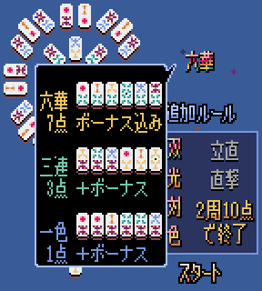

# 六華（リッカ）

[六華](https://arclightgames.jp/product/750rikka/)を参考にしました。

## 操作方法

* マウスを使って操作します。
* 場の牌をクリックして選択し、もう一回クリックすると手牌に加えます。
  * 「回転」ボタンをクリックすると、上下反転します。
  * 「ソート」ボタンをクリックすると、昇順に並べ替えます。
* 手牌のクリックして選択し、同じ牌をクリックすると、場に捨てます。
  * 違う牌をクリックすると、位置を交換します。
* 役が完成したら、「アガる」ボタンを2回クリックすると、アガります。
* 3秒程度長押しすると、相手の牌がオープンになります。

## 遊び方

* プレイヤーが牌をそれぞれ5枚ずつ持った状態でスタートします。
* 場の牌を1枚引いては、1枚捨てて、手牌の6枚で「役」を完成させることを目指します。
* スタートプレイヤー（最初に手番を行う人）の手番から始まり、時計回りの順に手番が移ります。
  1. 場の牌を1枚選んで引き、手牌に加えます。オモテ向きの牌を引いてもよいです。
  2. 6枚の手牌から不要な1枚を選び、捨てます（場にオモテ向きで置く）。
  3. 時計回りの順で、次の人に手番が移ります。
* 誰かが役を完成させるまで、くり返します。
* 役を完成させたら、ゲームは終了し、得点計算を行います。
  * 役を完成させた人は、役とボーナスに応じた得点を得ます。
  * 「ついでに完成」ができる人（あと1枚で役が完成する状態で、その必要な1枚が場にオモテ向きの場合）も、役とボーナスに応じた得点を得ます。
* 次のゲームを新しく始めます。
* こうしてゲームをくり返し、誰かの得点が10点以上になる、または全員がスタートプレイヤーを2回ずつ行ったら、ゲームは完全に終了します。
* 最も得点が多い人が優勝です。

## 基本役

* 一色（イッシキ）
  * 手牌6枚の下の数を1種類にそろえる。
* 三連（サンレン）
  * 手牌6枚を「3枚セット（3枚の下の数を1種類にそろえ、上の数を連番にそろえる形）」2つにそろえる。
* 六華（リッカ）
  * 手牌6枚の下の数を1種類にそろえ、上の数を1～6の連番にそろえる。
* 輝きボーナス
  * 手牌の中に「上下同じ数」があれば、1つにつき、1点の追加ボーナスを得る。

## 追加役

* 無双（ムソウ）
* 輝光（キコウ）
* 三対（サンツイ）
* 三色（サンシキ）
